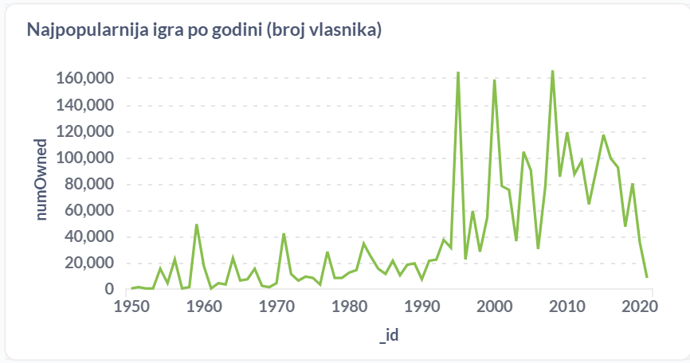
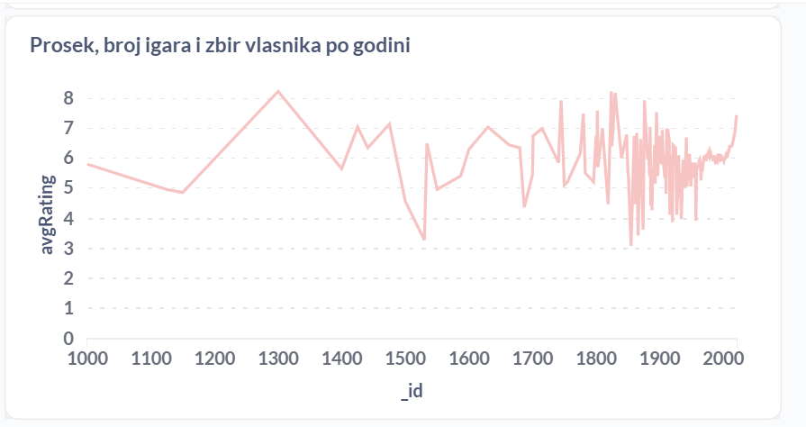
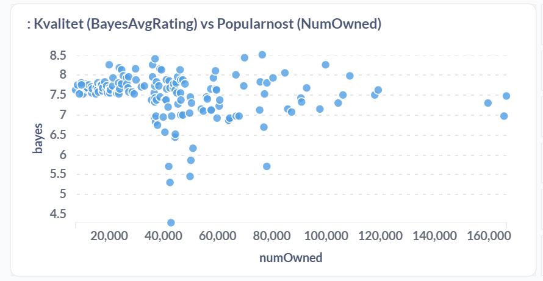
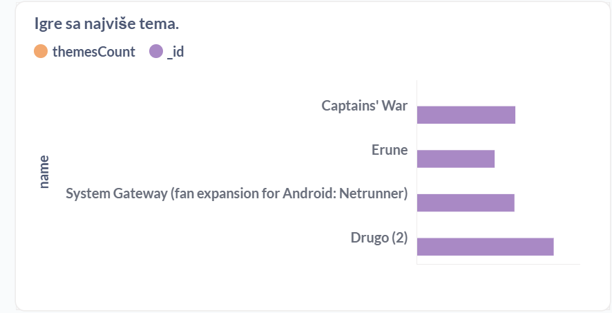

# BGG Analytics — MongoDB mini-project

This repository contains a small analytics pipeline for a BoardGameGeek (BGG) dataset using Node.js (ESM) and the official MongoDB driver. It includes ETL scripts, baseline and optimized aggregation queries (Q1–Q5), measurement harness, index-creation code, and a short report with timings.

## Quick status
- Database: `mongo_database2` (used during experiments)
- Report: `report/summary.md`, `report/metrics.csv` (generated by the run harness)


## Data cleaning performed before analytics
- Normalized field names and capitalizations when mapping from `games_raw` to `games` (see `src/etl/build-games.js`).
- Converted numeric-like strings to numbers (helper `mapNumber`).
- Detected and skipped invalid/empty years during ETL (resulting `year: null` when invalid) — see `build-games.js` mapping for `year`.
- Ratings distribution is attached from `ratings_distribution_raw` when available.

Notes: the ETL tries multiple common source field names (e.g., `AvgRating`, `avgRating`, `Average`) to be robust across dumps.

## Baseline queries (what they compute + baseline measured times)
Times below are worst-case (max) ms measured during the baseline runs (see `report/summary.md` for details and min/median values).

- Q1 — Most frequent mechanics for games with avgRating > 8
  - File: `src/queries/Q1.baseline.js`
  - Task: $match avgRating > 8, $unwind mechanics, $group by mechanic, $sort by gamesCount
  - Baseline max: 55.40 ms

- Q2 — Games / themes with largest theme counts
  - File: `src/queries/Q2.baseline.js`
  - Task: compute number of themes per game and sort to find top theme-rich games
  - Baseline max: 663.88 ms

- Q3 — Designer–publisher pairs (top pairs by gamesCount, with sufficient ratings)
  - File: `src/queries/Q3.baseline.js`
  - Task: $unwind designers and publishers, $group by pair, filter by sumNumRatings >= threshold
  - Baseline max: 201.94 ms

- Q4 — Best games per year (yearly averages/top game)
  - File: `src/queries/Q4.baseline.js`
  - Task: group by year and pick best by avgRating / popularity
  - Baseline max: 166.87 ms

- Q5 — Quality vs Popularity top lists
  - File: `src/queries/Q5.baseline.js`
  - Task: global sorts by bayesAvg and popularity.numOwned to get top-N
  - Baseline max: 119.80 ms

## ETL scripts (what they do)
- `src/etl/import-csvs-stream.js` — streamed importer for raw CSVs into `*_raw` collections (avoids OOM)
- `src/etl/import-designers-publishers.js` — focused streaming importer for designers and publishers (handles tricky CSV formatting)
- `src/etl/import-selected-stream.js` — targeted streamer for very large CSVs (user_ratings, etc.)
- `src/etl/build-games.js` — denormalizes `games_raw` -> `games` (preloads helper maps, maps many field name variants)
- `src/etl/build-mechanic-stats.js` — aggregates mechanics into `mechanic_stats`
- `src/etl/build-designer-publisher-stats.js` — computes designer_publisher_stats by preloading `designers_raw`/`publishers_raw` and scanning `games` (robustified in this repo)
- `src/etl/build-dp-from-reduced-csv.js` — (CSV parser) builds `designer_publisher_stats` by parsing pivoted reduced CSVs (used when raw imports are pivoted)
- `src/etl/build-yearly-stats.js` — builds `yearly_stats`
- `src/etl/build-rank-cache.js` — builds `rank_cache` (placeholder)

NOTE: `build-dp-from-reduced-csv.js` was added to parse pivoted reduced CSVs and populate `designer_publisher_stats` when the raw designer/publisher imports are pivoted 0/1 matrices.

## Optimized queries (what changed + optimized times)
Each optimized query prefers a precomputed helper collection or uses a multikey/sort index to reduce IO.

- Q1 optimized (`src/queries/Q1.optimized.js`)
  - Use `mechanic_stats` if available, else rely on index `{ avgRating:-1, mechanics:1 }`.
  - Optimized max: ~11.7 ms

- Q2 optimized (`src/queries/Q2.optimized.js`)
  - Use `theme_count_rank` if present, else rely on index `{ themes:1, avgRating:-1 }`.
  - Optimized max: ~7.9 ms

- Q3 optimized (`src/queries/Q3.optimized.js`)
  - Prefer `designer_publisher_stats` (precomputed). If not present, falls back to aggregation with unwind/unwind/group.
  - Optimized max: ~7.7 ms (with precomputed `designer_publisher_stats` populated from reduced CSVs in this run)

- Q4 optimized (`src/queries/Q4.optimized.js`)
  - Use `yearly_stats` precomputed or index `{ year:1, avgRating:-1, 'popularity.numOwned': -1 }`.
  - Optimized max: ~8.07 ms

- Q5 optimized (`src/queries/Q5.optimized.js`)
  - Use `rank_cache` or indexes `{ bayesAvg:-1 }` and `{ 'popularity.numOwned': -1 }` to compute top-N.
  - Optimized max: ~7.8 ms

## Indexes created by `src/indexes/create-optimized-indexes.js`
- `idx-q1-mech` — `{ avgRating: -1, mechanics: 1 }` (Q1)
- `idx-q2-themes` — `{ themes: 1, avgRating: -1 }` (Q2)
- `idx-q3-designers` — `{ designers: 1 }` and `idx-q3-publishers` — `{ publishers: 1 }` (help Q3 fallback)
- `idx-q4-year` — `{ year: 1, avgRating: -1, 'popularity.numOwned': -1 }` (Q4)
- `idx-q5-bayes` — `{ bayesAvg: -1 }` and `idx-q5-popularity` — `{ 'popularity.numOwned': -1 }` (Q5)

Helper collection indexes:
- `mechanic_stats`: `idx-q1-mechstats-avg`, `idx-q1-mechstats-count`
- `designer_publisher_stats`: `idx-q3-dpstats` (gamesCount, sumNumRatings)
- `theme_count_rank`: `idx-q2-theme-rank`
- `rank_cache`: `idx-q5-rankquality`, `idx-q5-rankpopularity`

## How to run the full experiment locally
Set env vars (PowerShell example):

```powershell
$env:MONGO_URI = 'mongodb://localhost:27018'
$env:DB_NAME = 'mongo_database2'
node src/run/full-run.js
```

---

## Indexes created and their target queries
All index creation code is in `src/indexes/create-optimized-indexes.js`. Indexes created (names used in experiment):

- `idx-q1-mech`: { avgRating: -1, mechanics: 1 } — helps Q1 by enabling selective scan of high-rated games and efficient multikey lookup on `mechanics`.
- `idx-q2-themes`: { themes: 1, avgRating: -1 } — assists Q2 when scanning/sorting by themesCount/avgRating.
- `idx-q3-designers`: { designers: 1 } and `idx-q3-publishers`: { publishers: 1 } — per-field multikey indexes that help group/filter prior to pair aggregation (MongoDB doesn't allow parallel-array compound index use for different arrays).
- `idx-q4-year`: { year: 1, avgRating: -1, 'popularity.numOwned': -1 } — prefix scatter for range-by-year then sorting by rating/owners.
- `idx-q5-bayes`: { bayesAvg: -1 } and `idx-q5-popularity`: { 'popularity.numOwned': -1 } — speed up top-N sorts for Q5 and the `rank_cache` build.

Helper collection indexes:
- `mechanic_stats`: `idx-q1-mechstats-avg`, `idx-q1-mechstats-count` (for Q1 optimized)
- `designer_publisher_stats`: `idx-q3-dpstats` (gamesCount & sumNumRatings)
- `theme_count_rank`: `idx-q2-theme-rank`
- `rank_cache`: `idx-q5-rankquality`, `idx-q5-rankpopularity`

## How to reproduce locally (short)
Set environment vars (PowerShell):
```powershell
$env:MONGO_URI = 'mongodb://localhost:27018'
$env:DB_NAME = 'mongo_database2'
npm run etl   # run ETL scripts (or run individual ETL files)
node src/indexes/create-optimized-indexes.js
node src/run/run-baseline.js
node src/run/run-optimized.js
node src/report/generate-report.js
```

---
## Metabase saved questions (screenshots)

The project includes screenshots of the Metabase saved questions used during the experiment. They are stored in the `data/` folder. Each image shows a Metabase card (query or visualization) for one of the Q1–Q5 experiment queries.


Below are the embedded screenshots (relative paths). Open them locally or in your editor to inspect the exact Metabase filters and visualizations used when running the experiment.







If you'd like, I can now:
- push this repository to `https://github.com/nadja1908/Mongo2` (I will attempt to push and report any auth errors),
- or modify README further to include exact pipeline snippets per query and paste them inline.

Tell me which and I'll proceed.
# BGG MongoDB Analytics

Ovaj projekat analizira BoardGameGeek (BGG) dataset koristeći MongoDB i Node.js (ESM, bez frameworka).

## Struktura repozitorijuma

```
/src/etl/          # ETL skripte za denormalizaciju i pomoćne kolekcije
/src/queries/      # Q1–Q5 baseline i optimized upiti
/src/lib/          # konekcija, merenje, util
/src/indexes/      # skripte za kreiranje indeks setova
/report/           # generisani Markdown/CSV izveštaji
```

## Pokretanje

1. Postavite .env fajl:

```
MONGO_URI=<MONGO_URI>
DB_NAME=<DB_NAME>
```

2. Instalirajte zavisnosti:

```
npm install
```

3. Pokrenite ETL fazu:

```
npm run etl
```

4. Pokrenite baseline upite:

```
npm run baseline
```

5. Pokrenite optimized upite:

```
npm run optimized
```

6. Generišite izveštaj:

```
npm run report
```

## Izlaz

- `report/metrics.csv`: metrika za svaki upit/varijantu (queryId, variant, indexSet, ms)
- `report/summary.md`: narativ, tabele "baseline vs optimized", ×-speedup, zaključci

## Kriterijumi prihvata

- `games` kolekcija sadrži polja kao u specifikaciji
- Q1–Q5 imaju baseline i optimized varijante, sa jasnim komentarima
- `runMetrics` ima zapise za sve upite i varijante (median od ≥5 pokretanja)
- `report/summary.md` prikazuje tabelu vremena i ×-speedup, plus zaključke
- Sve skriptovi se pokreću iz npm run ... bez ručnog editovanja

## Primer .env

```
MONGO_URI=mongodb://localhost:27017
DB_NAME=bgg
```
